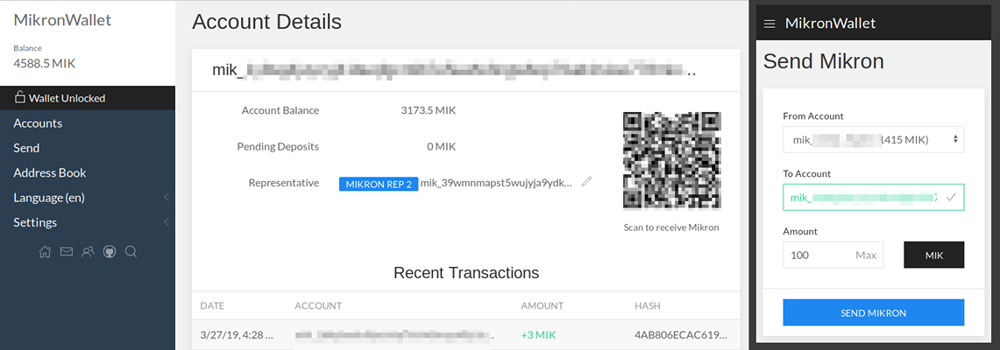

# MikronWebWallet

MikronWebWallet is a fully client-side signing wallet for sending and receiving [Mikron](https://mikron.io) 
[in your browser](https://wallet.mikron.io)



MikronWebWallet is based on [NanoVault.io](https://nanovault.io)
___

# Table of Contents
* [Bugs/Feedback](#bugsfeedback)
* [Application Structure](#application-structure)
* [Development Prerequisites](#development-prerequisites)
* [Development Guide](#development-guide)
* [Acknowledgements](#acknowledgements)


# Bugs/Feedback
If you run into any issues, please use the [GitHub Issue Tracker](https://github.com/mikroncoin/mikron-vault-web/issues) or head over to our [Discord Server](https://discord.gg/QBKr3hv)!  
We are continually improving and adding new features based on the feedback you provide, so please let your opinions be known!

___

#### Everything below is only for contributing to the development of MikronWebWallet
#### To use the web wallet, go to [wallet.mikron.io](https://wallet.mikron.io)

___

# Application Structure

The application is broken into a few separate pieces:

- [Mikron-Vault-Web](https://github.com/mikroncoin/mikron-vault-web) - The main wallet application (UI + Seed Generation/Block Signing/Etc).
- [Mikron-Vault-Server](https://github.com/mikroncoin/mikron-vault-server) - Serves the Wallet UI and brokers public communication between the wallet and the Mikron node.
- [Mikron-Vault-WS](https://github.com/mikroncoin/mikron-vault-ws) - Websocket server that receives new blocks from the Mikron node and sends them in real time to the wallet ui.


# Development Prerequisites
- Node Package Manager: [Install NPM](https://www.npmjs.com/get-npm)
- Angular CLI: `npm install -g @angular/cli`


# Development Guide
#### Clone repository and install dependencies
```bash
git clone https://github.com/mikroncoin/mikron-vault-web
cd mikron-vault-web
npm install
```

#### Run the wallet in dev mode
```bash
npm run wallet:dev
```

## Build Wallet (For Production)
Build a production version of the wallet for web:
```bash
npm run wallet:build
```

Build a production version of the wallet for desktop: *(Required for all desktop builds)*
```bash
npm run wallet:build-desktop
```

## Running unit tests

Run `ng test` to execute the unit tests via [Karma](https://karma-runner.github.io).

## Running end-to-end tests

Run `ng e2e` to execute the end-to-end tests via [Protractor](http://www.protractortest.org/).

## Language Selection

The selected UI language is based on several factors, in the given order of precedence.  A setting is taken into account only if present, and represents one of the available languages.

- Query param, if present.  E.g. '?lang=en', to the opening page
- Language selected in the menu and saved with the settings (in the local storage)
- Language setting of the browser
- The default English (en).

# Steps for releasing a new version

* Update version in package.json (2 places, version, buildVersion)
* Commit
* Tag, e.g. git tag v1.2.0
* Push, Push tags
* Build npm run wallet:build
* Rename and tar resulting dist folder, e.g. mikton-vault-web.v1.2.0.tgz
* On Github releases page, add tgz to release
* Deploy release under prod web server

# Acknowledgements
Special thanks to the following!
- [nanovault](https://github/cronoh/nanovault) - The NanoVault Nano web wallet
- [numtel/nano-webgl-pow](https://github.com/numtel/nano-webgl-pow) - WebGL PoW Implementation
- [jaimehgb/RaiBlocksWebAssemblyPoW](https://github.com/jaimehgb/RaiBlocksWebAssemblyPoW) - CPU PoW Implementation
- [dcposch/blakejs](https://github.com/dcposch/blakejs) - Blake2b Implementation
- [dchest/tweetnacl-js](https://github.com/dchest/tweetnacl-js) - Cryptography Implementation

